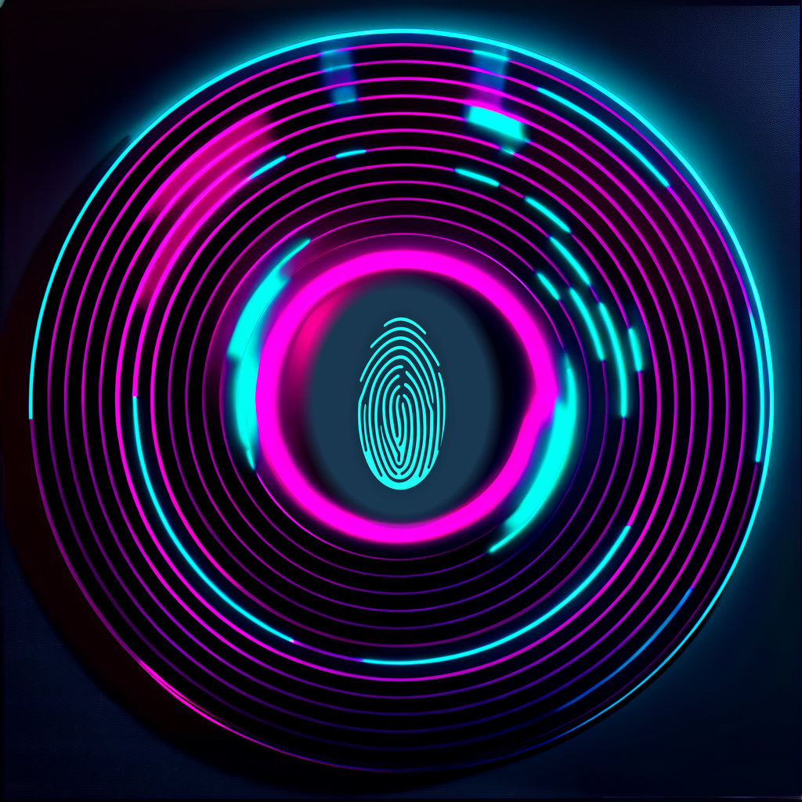

<p align="center">
  
</p>

# Super Synth Lab - Instrument

**[Try it now](https://hanishn.github.io/SuperSynthLabInstrument/)** | **[Join the Discord](https://discord.gg/2QmW8FJdgW)**

Super Synth Lab - Instrument (SSLI) is a browser-based synthesizer featuring 17+ synthesis engines (subtractive, FM, physical modelling, granular, additive, and more), 21+ audio effects, MIDI controller support, and 15 playing surfaces including piano, isomorphic grids, fretboard, and percussion pads. It runs entirely in your browser with no accounts, no data collection, and no installation required.

SSLI is the instrument module of the larger Super Synth Lab project. Commercial versions for iOS, Steam, and other platforms are planned.

## Features

- **17+ synthesis engines** -- subtractive, FM, physical modelling, granular, additive, wavetable, Karplus-Strong, and more
- **21+ audio effects** -- reverb, delay, chorus, distortion, flanger, phaser, and more
- **15 playing surfaces** -- piano keyboard, isomorphic grids, tonnetz, fretboard, steel pan, hand pan, accordion, ribbon controller, MPE pads, and more
- **MIDI support** -- connect hardware keyboards and controllers
- **Touch velocity** -- pressure-sensitive touch input on supported devices
- **Fully private** -- no data collection, no audio recording, no accounts. All settings stored locally on your device.

## Building from Source

Requires Python 3.6+. No other dependencies.

```
python build.py
```

Produces `dist/index.html` -- a self-contained file with all CSS, JS, and data inlined.

## Running

Open `index.html` (or `dist/index.html` after building) in any modern browser (Chrome, Firefox, Safari, Edge). No server required.

Or visit the hosted version: **https://hanishn.github.io/SuperSynthLabInstrument/**

## Creator

Nathan Hanish

Built with the help of [Claude Code](https://claude.ai/code) and [Clairvoyance](https://www.clairvoyanceai.com/).

## License

Licensed under the Apache License, Version 2.0. See [LICENSE](LICENSE) for details.

"Super Synth Lab", "SSLI", and "Super Synth Lab - Instrument" are names reserved by the creator. See [NOTICE](NOTICE).
